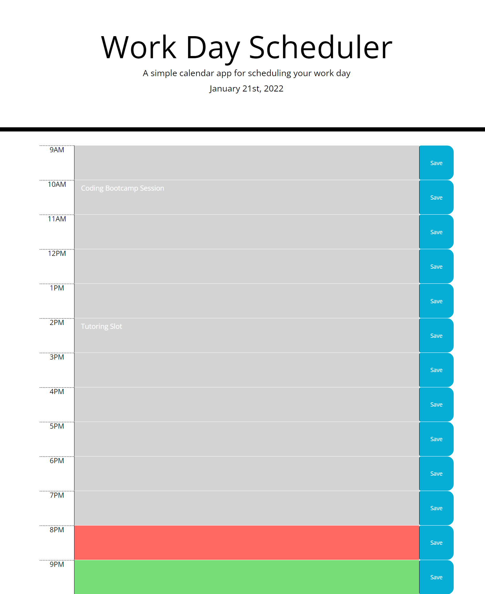

# Moments-Scheduler

Overview:

This application is a calendar that allows a user with a busy schedule to save events for each hour of the day. The app runs in the browser and feature dynamically updated HTML and CSS powered by jQuery.

Functionality:

When the user opens the planner, the current day is displayed at the top of the calendar. Users are able to scroll down and are presented with time-blocks for with incrementing hours. When they view the time-blocks for that day, then each time-block is colour coded to indicate whether it is in the past (grey), present (red), or future (green). Once a user clicks into a time-block, they can enter an event and save the information by clicking the blue save button to the right of that time-block. The text for that event is saved in local storage and when a user refreshes the page then the saved events persist.

What to Expect:

LinksL  
https://github.com/NAli3107/Moments-Scheduler
https://nali3107.github.io/Moments-Scheduler/